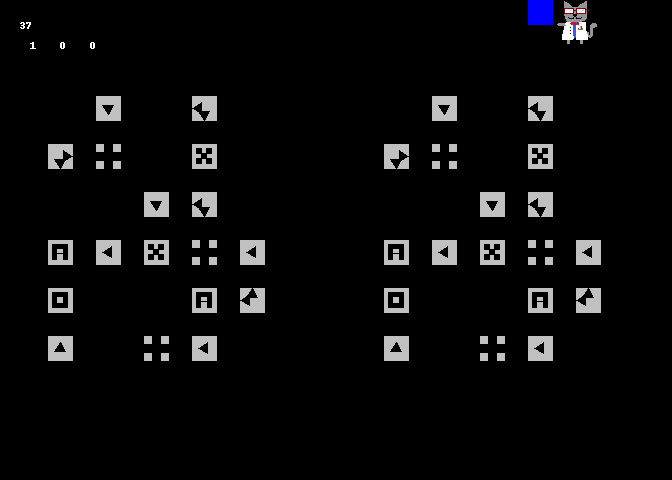

# A cat that adds two numbers together

## Examples

This code generates GIFs of [N-bit adders](https://en.wikipedia.org/wiki/Adder_(electronics)). Give it two numbers and it will add them together!

`1 + 1 = 2`



`98 + 123 = 221`


## Legend

Here's what all the little icons mean

  * **Squares with arrows** These redirect a signal/wire into one or more directions :twisted_rightwards_arrows:
  * **Squares with crosses** These junctions let signals/wires cross each other without interfering :heavy_plus_sign:
  * **X** A *XOR* gate. It will output a signal if receives exactly one signal. It turns off if it gets 0 or 2. :raised_hands:
  * **A** An *AND* gate. It will output a signal only if it receives two signals. :people_hugging:
  * **O** A *OR* gate. As long as it receives at least one signal, it outputs one too. It's still happy if it gets two signals. :heart_eyes:
  * **Science cat** It's a cat! :smiley_cat:

## Theory of Operation

(The code is quite a bit messy because I only really planned the basics on paper before starting to code. I didn't anticipate this to be so buggy.)

The system recreates an [adder](https://en.wikipedia.org/wiki/Adder_(electronics)), which is a system of electronic components for adding numbers by manipulating bits.

The circuit logic happens on a **Grid** object with X,Y coordinates. This grid may contain empty space, **Wires** or **Component**. **Signals** are initiated from the top and carry **Color**.

**Wires** transmit **Signals** transparently without resistance.

**Components** block **Signals** but will emit their own **Signals** under certain conditions. For example an *AND* gate will emit a **Signal** with a **Color** if it receives two different **Colors**.

If a **Component** ever decides not to transmit a **Signal** anymore, it sends out a **Signal** with an anti-**Color** to undo the **Signal** it was transmitting before.

All these events are handled with a queue that handles blocked signals, new signals, etc.

## Usage

The examples above were made with

```
python nbit_adder.py 1 1 -n 2 -s 24
```

and

```
python nbit_adder.py 98 123 -n 8 --loop
```

Here is the help information

```
python nbit_adder.py --help

usage: nbit_adder.py [-h] [-n NBITS] [-s CELL_SIZE] [-r] [-l] [-v] a b

Add two numbers together graphically

positional arguments:
  a                     First number
  b                     Second number

options:
  -h, --help            show this help message and exit
  -n NBITS, --nbits NBITS
                        Bit-size of adder
  -s CELL_SIZE, --cell_size CELL_SIZE
                        Size in pixel of each cell in the grid
  -r, --no_render       Whether to *not* render an image file
  -l, --loop            Whether to loop the GIF
  -v, --verbose         Whether to print out a lot of information
```
